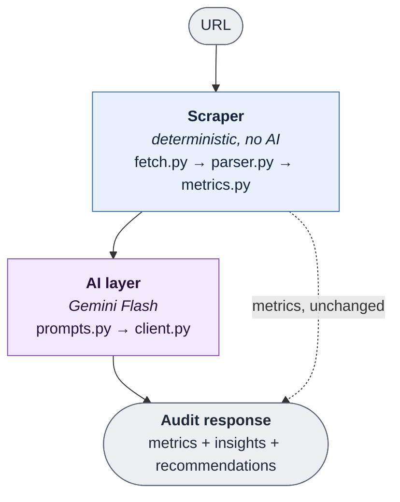

# AI-Powered Website Audit Tool

## Overview

Takes a URL, extracts factual, measurable metrics from the page, and uses an LLM to turn those
metrics into structured insights and prioritized recommendations. Available as a JSON API, a
single-page web UI, and a CLI.

The core idea: keep facts and AI opinions separate. Metrics are computed by deterministic code; the
AI layer only interprets what the code already measured, and never invents or overwrites a number.

## Architecture



- **The scraper is deterministic.** Every metric is computed in code from the cleaned page. No AI
  involved, so the same page always produces the same numbers.
- **The AI layer never sees raw HTML.** It only receives the computed metrics and the page's visible
  text, and only reasons about what they mean.
- **Facts and AI output never mix.** The model's output schema holds insights and recommendations
  only. The metrics block is attached afterward, copied straight from the scraper (the dashed line in
  the diagram). The model can't change a single number it was given.

## Project structure

```
app/
├── llm/                   # AI layer: prompt construction + Gemini client
│   ├── client.py
│   ├── prompt_logger.py
│   └── prompts.py
├── scraper/               # Deterministic metric extraction
│   ├── fetch.py
│   ├── metrics.py
│   ├── parser.py
│   └── scrape.py
├── static/
│   └── index.html         # Web UI
├── config.py              # Settings, loaded from .env
├── main.py                # FastAPI app and the /audit route
├── schemas.py             # Pydantic models, the API contract
└── web_audit_tool.py      # Orchestrator: scrape -> AI -> response

tests/
├── conftest.py
├── test_client.py
├── test_fetch.py
├── test_main.py
├── test_metrics.py
├── test_parser.py
├── test_prompts.py
├── test_scrape.py
└── test_web_audit_tool.py

pyproject.toml
.env.example
```

Each package also has an `__init__.py`, omitted above for brevity.

## Setup

```bash
uv sync
cp .env.example .env   # add your Gemini API key
uv run pytest          # optional, 45 tests
```

Uses **Google Gemini `gemini-3.6-flash`**. Get a free key at
<https://aistudio.google.com/apikey>, no credit card required, and set it as `GEMINI_API_KEY`. 

## Running

```bash
uv run fastapi dev app/main.py
```

- **Web UI:** <http://127.0.0.1:8000>
- **Swagger UI:** <http://127.0.0.1:8000/docs>
- **API:** `POST /audit` with `{"url": "..."}`:

  ```bash
  curl -X POST http://127.0.0.1:8000/audit \
    -H "Content-Type: application/json" \
    -d '{"url": "https://example.com"}'
  ```

- **CLI:** no server needed, prints the same JSON:

  ```bash
  uv run -m app.web_audit_tool https://example.com
  ```

Errors use distinct codes rather than a blanket 500: `422` means the page couldn't be fetched
(network failure, non-2xx, non-HTML, bot-blocked); `502` means the AI provider failed. A caller can
tell "this page is unauditable" apart from "the model is unavailable".

## Prompt logs

Every successful model call writes a plain-text file to `logs/`: the exact system prompt, the user
prompt, the schema name, the model's raw output, and the parsed result. Sections are labeled plain
text, not an escaped JSON blob, so they're easy to read. This happens automatically on every real
call, so there's nothing to enable.

## Design decisions & trade-offs

- **A free model was a deliberate constraint.** Gemini's Flash free tier needs no billing setup to
  run or review this project. The cost is a thin daily quota, and that shapes several decisions below:
  one model call per audit instead of a multi-pass chain, citation grounding as a one-shot instruction
  instead of a verify-and-retry loop, and `429`s failing fast instead of retrying. On a daily quota, a
  `429` means the quota is exhausted, and backoff can't close that gap.
- **Metrics are computed in code, never by the model.** Counts are exact, reproducible facts. A model
  asked to count links or words from HTML would approximate, and could answer differently each run.
- **Structured output is enforced by schema, not prompt text.** The response schema is passed to
  Gemini as JSON schema, constraining output at the decoding level. The prompt's job is different: it
  shapes what content goes in each field, not what shape the JSON takes.
- **Insights must cite their metrics.** Each insight pairs a short analysis with the exact metric
  fields behind it, copied verbatim as `"field_name: value"`. This makes grounding visible instead of
  something you take on trust. It's currently a prompt-level rule though, not one checked in code (see
  [Future improvements](#future-improvements)).
- **Tuned for reproducibility, not creativity.** Temperature 0, minimal thinking, capped output
  length. Re-auditing the same URL should give the same findings, not a different set from sampling
  variance. This is bounded extraction over pre-computed metrics, not open-ended reasoning, so deeper
  thinking would only add latency.
- **The prompt teaches the model how to read the numbers, not just what to write.** A few metrics are
  easy to misread: heading *sequence* over raw counts to catch hierarchy jumps; CTA count treated as
  possibly inflated by navigation links; *unique* link destinations, not instance counts, for
  directory-vs-content judgments; decorative `alt=""` treated as correct markup, not a defect.
- **Page text is treated as untrusted input.** The model is told to treat anything that looks like an
  instruction inside scraped content as just more content to evaluate, flagging it as a finding if it
  looks manipulative, rather than obeying it.
- **Retries only happen where they can help.** Timeouts, connection errors, 5xx responses, and
  schema-violating output retry with backoff, under a hard per-request timeout. Once retries are
  exhausted, the failure is wrapped in the app's own error type, so a genuine bug in our code still
  surfaces as a 500 instead of being mislabeled as an AI failure.

## Limitations

- **No headless browser or JS execution.** A plain HTTP client, so JS-rendered pages and
  bot-protection interstitials (e.g. Cloudflare's "Just a moment…") fail with a clear error instead of
  being silently audited as real content.
- **CTA detection is a heuristic.** Counts semantic `<button>` elements, form submit inputs, links
  with `role="button"`, and conventional `btn`/`cta` class names. A link styled purely through utility
  classes with no semantic marker goes uncounted.
- **Hidden-text detection sees only static markup.** Catches the `hidden` attribute and inline
  `display:none`/`visibility:hidden` (nobody sees that text), but not `aria-hidden` (sighted visitors
  still see it). Can't distinguish a legitimate accordion panel from keyword cloaking.
- **Chrome removal relies on semantic HTML5.** Strips `<nav>`/`<header>`/`<footer>` before counting
  any metric, so a nav heading can't fake a hierarchy problem. A site wrapping its chrome in plain
  `<div>`s, though, won't be stripped.

## Validation

Every metric was cross-checked against a large real page (565KB HTML, 1200+ links) by independently
re-implementing each metric definition and diffing the results; all fields matched exactly.

The 45-test suite covers both halves of the tool, not just the scraper. Scraper coverage: heading
order, link normalization and deduplication, non-navigational link schemes, missing versus decorative
alt text, chrome exclusion, text extraction, and network failure modes (timeouts, non-2xx, non-HTML).
AI layer and API coverage: the retry policy (which errors retry, which don't, and the `429`
fail-fast rule), prompt construction and truncation, the orchestrator's scrape-then-analyze wiring,
and the `/audit` route's error-code mapping. All AI calls are mocked; no test hits the real Gemini
API.

## Future improvements

- **Verify citations in code.** Grounding is currently enforced only by asking the model nicely;
  nothing checks a citation against the real metrics. This splits into two costs:
  - *Detecting* a mismatch is cheap: every citation is already `"field_name: value"`, so it's a
    lookup and a comparison, no extra API call. Just hasn't been built yet.
  - *Fixing* a mismatch means re-calling the model with the discrepancy as feedback, which doubles
    the request cost, expensive against a ~20-request/day quota. Exact matching also can't tell a
    hallucination from a rounded citation ("roughly 260 words"), so a retry loop needs care.
- **Split the audit into two passes:** insights, then recommendations conditioned on them, instead of
  both from one call. Better output, at twice the quota cost.
- **Adversarial self-review pass:** a second call given the insights and the metrics, asked only to
  find claims the metrics don't support.
- **Cache audits per URL**, and let the model tier scale with the key: Flash on a free key, a
  stronger model once billing is available.
- **Give the model more to reason over:** a "% of page text hidden by default" metric so it can flag
  keyword-stuffing risk explicitly, and a Playwright fallback so JS-rendered pages reach the AI layer
  at all.
- **Smarter 429 handling.** Gemini's error details distinguish per-minute throttling from
  daily-quota exhaustion; reading that would let a short-lived throttle retry while a daily-quota
  failure still fails fast.
- **SSRF hardening and a response size cap** before this is deployed as a service anyone can point at
  arbitrary URLs. It currently fetches any user-supplied URL with no IP allowlist or body limit.
